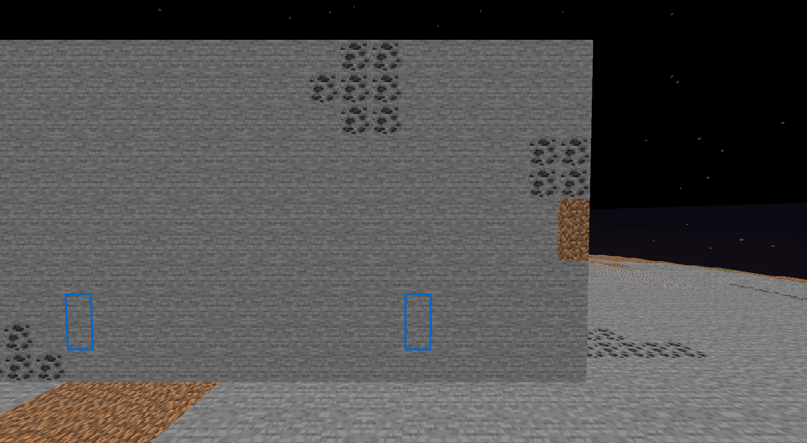
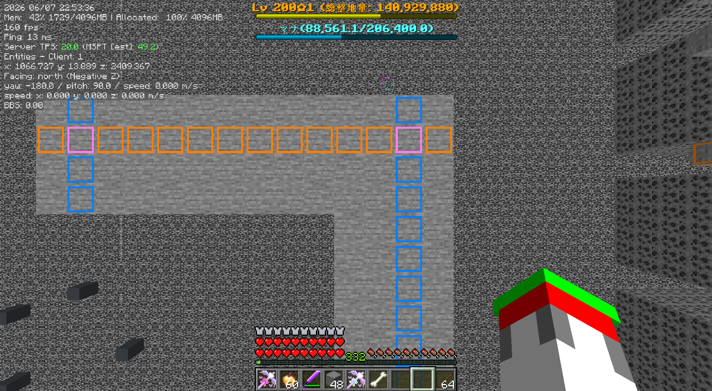
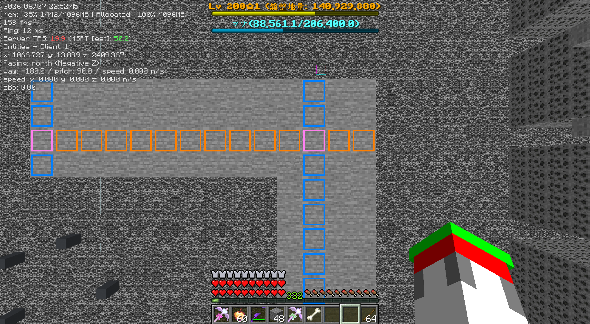

# 整地鯖用整地支援テクスチャ
[たかさわかーる](https://github.com/Helium745/TakasaWakaru)にインスパイアされたテクスチャ  
  
青い枠が本テクスチャ 掘る位置がわかります
# 特徴
- 掘る位置を示します ブロックを数える必要はもうありません
- 視認性がよいです 1方向に青,もう1方向に橙,交点に桃色を採用しました
- たかさわかーるとの併用も可能です
- 設定を変更するとあらゆるスキルに対応できます
# 前提Mod
[Continuity](https://modrinth.com/mod/continuity)
たぶんこれだけで動きます
# 導入
1. [リリースページ](https://github.com/x256x/IchiWakaru/releases)より必要なテクスチャをダウンロードしてください
2. 解凍した中身をリソースパックフォルダに入れてください
3. オフセットとは左右のズレのことです 整地範囲に合わないときはオフセットの異なるテクスチャを適用してください。(画像参照)  
  

# 設定
各.propertiesファイルを適宜調べながらheights,width,height,tilesあたりを変更してください  
heightsは開始高さ スキルの高さを指定するとよいです  
width,heightはリピート単位 スキルの幅を指定するとよいです  
tilesはリピート内のテクスチャの配置 各ファイルに全て同じ値を設定するとよいです
# ライセンス
CC0です  
ご自由にどうぞ
